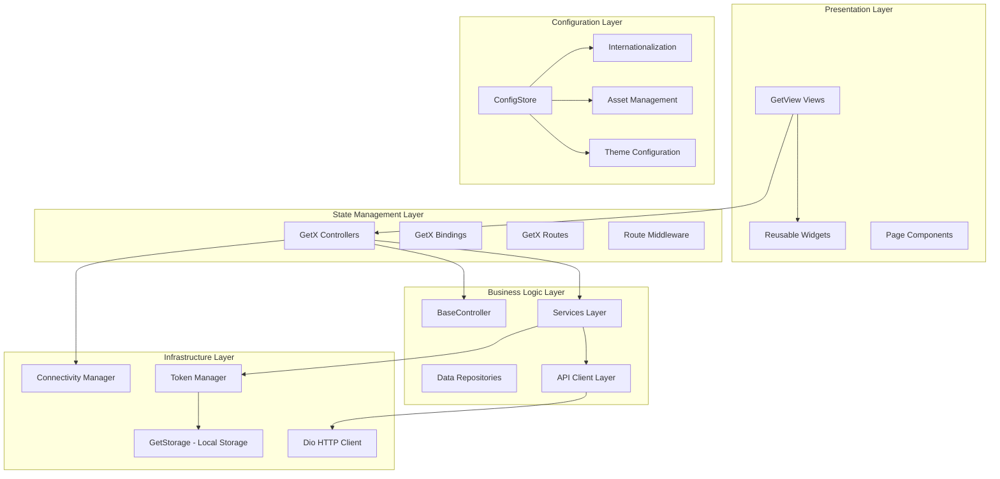
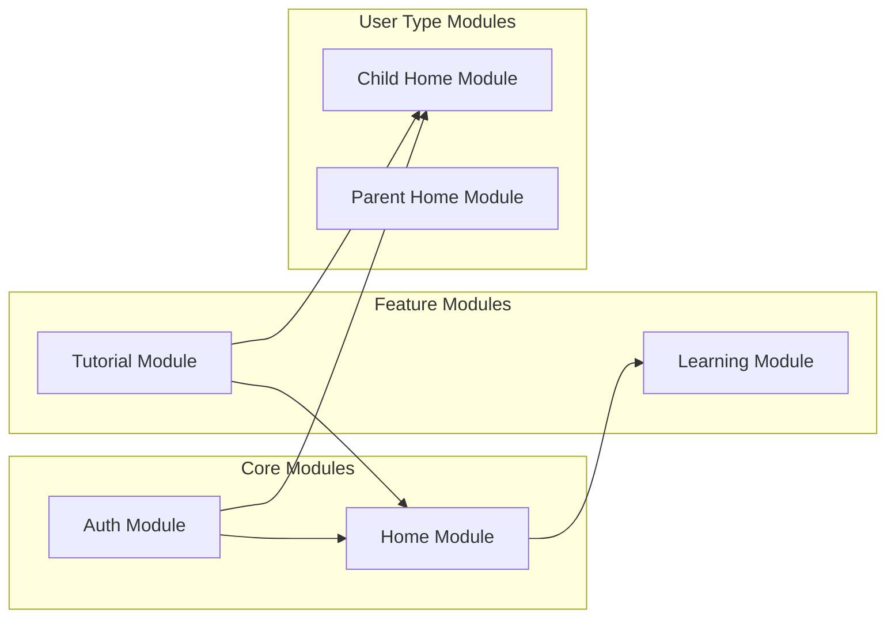

# KiokuNaviApp Architecture Document

## System Overview

KiokuNaviApp is a comprehensive Flutter mobile application for memory and knowledge management built using the **GetX architectural pattern**. It provides a mobile-first learning experience with robust responsive design, internationalization support, and efficient state management for both students and parents in the Japanese education system.

## Architecture Diagram



## Module Architecture

### GetX Module Structure Pattern

Following the **get_cli** pattern, each module follows this structure:

```
lib/app/modules/
└── module-name/
    ├── bindings/
    │   └── module_binding.dart        # Dependency injection
    ├── controllers/
    │   └── module_controller.dart     # Business logic
    └── views/
        ├── module_view.dart           # Main view
        ├── widgets/                   # Module-specific widgets
        └── sub_views/                 # Sub-views if needed
```

### Current Module Organization



## Design Patterns

### 1. GetX Controller Pattern

**MANDATORY**: All controllers must extend `BaseController` for consistent error handling and navigation:

```dart
import 'package:kioku_navi/controllers/base_controller.dart';

class AuthController extends BaseController {
  // Reactive variables
  final RxBool isLoading = false.obs;
  final RxString error = ''.obs;

  // Form controllers
  final email = TextEditingController();
  final password = TextEditingController();

  // Services injection
  late final AuthApi _authApi;

  @override
  void onInit() {
    super.onInit();
    _authApi = Get.find<AuthApi>();
  }

  // Business logic with error handling
  Future<void> loginStudent(BuildContext context) async {
    await safeApiCall(
      () async {
        final response = await _authApi.loginStudent(
          email.text.trim(),
          password.text.trim()
        );
        return response;
      },
      context: context,
      loaderMessage: LocaleKeys.common_messages_loggingIn.tr,
      onSuccess: () => requestNavigation(Routes.CHILD_HOME),
      onError: (error) => CustomSnackbar.showError(
        title: LocaleKeys.common_messages_loginFailed.tr,
        message: LocaleKeys.common_messages_checkCredentials.tr,
      ),
    );
  }
}
```

### 2. GetView Pattern

**MANDATORY**: All views must use `GetView<Controller>` for automatic controller binding:

```dart
class AuthView extends GetView<AuthController> {
  const AuthView({super.key});

  @override
  Widget build(BuildContext context) {
    // Setup navigation callback
    controller.setupNavigation();

    return Scaffold(
      body: Obx(() => _buildContent()),
    );
  }

  Widget _buildContent() {
    return Column(
      children: [
        // Reactive UI elements
        if (controller.isLoading.value)
          const CircularProgressIndicator(),

        // Form fields
        CustomTextFormField(
          textController: controller.email,
          labelText: LocaleKeys.pages_login_form_email_label.tr,
        ),

        // Actions
        CustomButton.primary(
          text: LocaleKeys.common_buttons_login.tr,
          onPressed: () => controller.loginStudent(context),
        ),
      ],
    );
  }
}
```

### 3. Dependency Injection Pattern

**MANDATORY**: All dependencies must be registered through Bindings:

```dart
class AuthBinding extends Bindings {
  @override
  void dependencies() {
    // Controller registration
    Get.lazyPut<AuthController>(AuthController.new);

    // Service registration (if module-specific)
    Get.lazyPut<AuthService>(() => AuthServiceImpl());
  }
}
```

### 4. Service Layer Pattern

**MANDATORY**: All API interactions must go through service layer:

```dart
abstract class AuthApi {
  Future<Map<String, dynamic>> loginStudent(String email, String password);
  Future<Map<String, dynamic>> loginParent(String email, String password);
  Future<Map<String, dynamic>> register(String name, String email, String password, String passwordConfirmation, String dateOfBirth);
  Future<void> logout();
  Future<Map<String, dynamic>> getCurrentUser();
}

class AuthApiImpl implements AuthApi {
  final BaseApiClient apiClient;
  final TokenManager tokenManager;

  AuthApiImpl({
    required this.apiClient,
    required this.tokenManager,
  });

  @override
  Future<Map<String, dynamic>> loginStudent(String email, String password) async {
    final response = await apiClient.post<Map<String, dynamic>>(
      'auth/login',
      data: {'email': email, 'password': password},
    );

    // Automatically save token after successful login
    await _saveTokenFromResponse(response);
    return response;
  }
}
```

## Development Guidelines

### BaseController Usage Standards

**MANDATORY**: All controllers must extend `BaseController` and follow these patterns:

#### 1. Safe API Call Pattern

```dart
class MyController extends BaseController {
  Future<void> performApiOperation(BuildContext context) async {
    await safeApiCall(
      () async {
        // Your API operation
        return await apiService.performOperation();
      },
      context: context,
      loaderMessage: 'Processing...',
      onSuccess: () {
        // Success callback - navigation/UI updates
        CustomSnackbar.showSuccess(title: 'Success', message: 'Operation completed');
        requestNavigation(Routes.NEXT_SCREEN);
      },
      onError: (error) {
        // Error callback - user feedback
        CustomSnackbar.showError(title: 'Error', message: 'Operation failed');
      },
    );
  }
}
```

#### 2. Navigation Helper Pattern

```dart
class MyController extends BaseController {
  void navigateToScreen() {
    // Use requestNavigation instead of Get.toNamed
    requestNavigation(Routes.TARGET_SCREEN);
  }
}

class MyView extends GetView<MyController> {
  @override
  Widget build(BuildContext context) {
    // Setup navigation in view
    controller.setupNavigation();
    return Scaffold(/* ... */);
  }
}
```

#### 3. Reactive State Management

```dart
class MyController extends BaseController {
  // Reactive variables
  final RxList<Item> items = <Item>[].obs;
  final RxBool isRefreshing = false.obs;
  final RxString searchQuery = ''.obs;

  // Computed properties
  List<Item> get filteredItems => items.where((item) =>
    item.name.toLowerCase().contains(searchQuery.value.toLowerCase())
  ).toList();

  // State management methods
  void addItem(Item item) {
    items.add(item);
  }

  void updateSearchQuery(String query) {
    searchQuery.value = query;
  }
}
```

### Responsive Design Standards

**MANDATORY**: All widgets must support responsive design using our responsive utilities:

#### 1. Responsive Wrapper Usage

```dart
class MyWidget extends StatelessWidget {
  @override
  Widget build(BuildContext context) {
    return ResponsiveWrapper(
      builder: (context, screenInfo) {
        final buttonHeight = ResponsivePatterns.buttonHeight.getValue(screenInfo);
        final isTablet = screenInfo.isTablet;

        return Container(
          height: buttonHeight,
          child: Text(
            'Responsive Text',
            style: TextStyle(
              fontSize: isTablet ? 18.0.sp : 14.0.sp,
            ),
          ),
        );
      },
    );
  }
}
```

#### 2. Extension Usage for Quick Access

```dart
class MyWidget extends StatelessWidget {
  @override
  Widget build(BuildContext context) {
    return Container(
      width: context.isTablet ? 60.0.wp : 80.0.wp,
      height: context.isSmallPhone ? 40.0.hp : 45.0.hp,
      padding: EdgeInsets.all(AppSpacing.md.wp),
      child: Text(
        'Responsive Text',
        style: TextStyle(fontSize: 14.0.sp),
      ),
    );
  }
}
```

#### 3. Adaptive Sizing for Complex Widgets

```dart
class CourseSectionWidget extends StatelessWidget {
  @override
  Widget build(BuildContext context) {
    final nodeSize = AdaptiveSizes.getNodeSize(context);
    final strokeWidth = AdaptiveSizes.getProgressStrokeWidth(context);
    final spacing = AdaptiveSizes.getNodeVerticalSpacing(context);

    return Column(
      children: nodes.map((node) => Container(
        width: nodeSize,
        height: nodeSize,
        margin: EdgeInsets.symmetric(vertical: spacing),
        child: CircularProgressIndicator(strokeWidth: strokeWidth),
      )).toList(),
    );
  }
}
```

### Internationalization Standards

**MANDATORY**: All user-facing strings must use internationalization:

#### 1. Locale Key Usage

```dart
// ✅ CORRECT - Using locale keys
Text(LocaleKeys.common_buttons_login.tr)
Text(LocaleKeys.pages_home_lesson.tr)
Text(LocaleKeys.validation_required.tr)

// ❌ INCORRECT - Hardcoded strings
Text('Login')
Text('Please fill this field')
```

#### 2. Locale File Structure

```dart
// Generated from assets/locales/en_US.json and ja_JP.json
class LocaleKeys {
  static const common_buttons_login = 'common_buttons_login';
  static const common_buttons_signup = 'common_buttons_signup';
  static const pages_home_lesson = 'pages_home_lesson';
  static const validation_required = 'validation_required';
}
```

#### 3. Translation File Organization

```json
// assets/locales/ja_JP.json
{
  "common_buttons_login": "ログイン",
  "common_buttons_signup": "新規登録",
  "pages_home_lesson": "5年下・第18回\n日本のおもな都市・地形図の読み方",
  "validation_required": "必須項目です"
}
```

### Widget Architecture Standards

**MANDATORY**: Follow these widget composition patterns:

#### 1. Custom Widget Structure

```dart
class CustomButton extends StatelessWidget {
  const CustomButton({
    required this.text,
    super.key,
    this.onPressed,
    this.buttonColor,
    this.textColor,
    this.height,
    this.disabled = false,
  });

  final String text;
  final VoidCallback? onPressed;
  final Color? buttonColor;
  final Color? textColor;
  final double? height;
  final bool disabled;

  // Factory constructors for common patterns
  factory CustomButton.primary({
    required String text,
    VoidCallback? onPressed,
    double? height,
  }) => CustomButton(
    text: text,
    onPressed: onPressed,
    buttonColor: kButtonPrimaryColor,
    textColor: Colors.white,
    height: height,
  );

  factory CustomButton.outline({
    required String text,
    VoidCallback? onPressed,
    double? height,
  }) => CustomButton(
    text: text,
    onPressed: onPressed,
    buttonColor: Colors.transparent,
    textColor: kButtonOutlineTextColor,
    height: height,
  );

  @override
  Widget build(BuildContext context) {
    final effectiveHeight = height ?? CustomButton.getResponsiveHeight(context);

    return Container(
      height: effectiveHeight,
      child: ElevatedButton(
        onPressed: disabled ? null : onPressed,
        style: ElevatedButton.styleFrom(
          backgroundColor: buttonColor,
          foregroundColor: textColor,
        ),
        child: Text(text),
      ),
    );
  }

  static double getResponsiveHeight(BuildContext context) {
    return ResponsivePatterns.buttonHeight.getValueForContext(context);
  }
}
```

#### 2. Accessibility Integration

```dart
class AccessibleWidget extends StatelessWidget {
  @override
  Widget build(BuildContext context) {
    return AccessibilityHelper.createAccessibleButton(
      child: CustomButton.primary(text: 'Action'),
      onPressed: () => performAction(),
      semanticsLabel: AccessibilityHelper.getButtonSemanticLabel(
        'Action',
        hint: 'Performs the main action',
      ),
    );
  }
}
```

### Error Handling Standards

**MANDATORY**: Comprehensive error handling through BaseController:

#### 1. API Error Handling

```dart
class MyController extends BaseController {
  Future<void> performOperation(BuildContext context) async {
    await safeApiCall(
      () async {
        // Validate input
        if (!formKey.currentState!.validate()) {
          throw ValidationException('Please fill all required fields');
        }

        // API call
        return await apiService.performOperation();
      },
      context: context,
      loaderMessage: 'Processing...',
      onSuccess: () {
        // Success handling
        CustomSnackbar.showSuccess(
          title: 'Success',
          message: 'Operation completed successfully',
        );
      },
      onError: (error) {
        // Specific error handling
        if (error is ValidationException) {
          CustomSnackbar.showError(
            title: 'Validation Error',
            message: error.message,
          );
        } else {
          CustomSnackbar.showError(
            title: 'Error',
            message: 'Operation failed. Please try again.',
          );
        }
      },
    );
  }
}
```

#### 2. Global Error Management

```dart
class ErrorManager extends GetxService {
  void handleError(dynamic error, {ErrorType? type, String? customMessage}) {
    final errorType = type ?? _determineErrorType(error);
    final message = customMessage ?? _getErrorMessage(error);

    final appError = AppError(
      type: errorType,
      message: message,
      details: error.toString(),
    );

    // Log error for debugging
    debugPrint('Error logged: $appError');

    // Show user-friendly error message
    _showErrorToUser(appError);
  }
}
```

## API Architecture

### HTTP Client Configuration

**MANDATORY**: All API calls must use the centralized BaseApiClient:

```dart
class BaseApiClient {
  late final Dio _dio;

  BaseApiClient._internal() {
    _initializeDio();
  }

  factory BaseApiClient() {
    _instance ??= BaseApiClient._internal();
    return _instance!;
  }

  void _initializeDio() {
    _dio = Dio(BaseOptions(
      baseUrl: kBaseUrl,
      connectTimeout: const Duration(seconds: 30),
      receiveTimeout: const Duration(seconds: 30),
      headers: {
        'Content-Type': 'application/json',
        'Accept': 'application/json',
      },
    ));

    // Add interceptors
    if (kDebugMode) {
      _dio.interceptors.add(LogInterceptor(/* ... */));
    }

    // Error handling interceptor
    _dio.interceptors.add(InterceptorsWrapper(
      onError: (error, handler) {
        final exception = _handleDioError(error);
        handler.reject(DioException(
          requestOptions: error.requestOptions,
          error: exception,
        ));
      },
    ));
  }
}
```

### Authentication Interceptor

**MANDATORY**: Automatic token management for API calls:

```dart
class AuthInterceptor extends Interceptor {
  final TokenManager tokenManager;

  @override
  Future<void> onRequest(RequestOptions options, RequestInterceptorHandler handler) async {
    // Skip auth for public endpoints
    if (_isPublicEndpoint(options.path)) {
      return handler.next(options);
    }

    // Add auth token if available
    final token = await tokenManager.getToken();
    if (token != null && token.isNotEmpty) {
      options.headers['Authorization'] = 'Bearer $token';
    }

    handler.next(options);
  }

  @override
  Future<void> onError(DioException err, ErrorInterceptorHandler handler) async {
    // Handle 401 Unauthorized errors
    if (err.response?.statusCode == 401 && !_isPublicEndpoint(err.requestOptions.path)) {
      await tokenManager.clearToken();
      return handler.reject(err);
    }

    handler.reject(err);
  }
}
```

## State Management Architecture

### Reactive Programming with GetX

**MANDATORY**: Use GetX reactive programming patterns:

#### 1. Observable Variables

```dart
class HomeController extends BaseController {
  // Simple observables
  final RxBool isLoading = false.obs;
  final RxString searchQuery = ''.obs;
  final RxInt selectedIndex = 0.obs;

  // Complex observables
  final RxList<CourseSection> courseSections = <CourseSection>[].obs;
  final Rx<Subject> selectedSubject = Subject.comprehensive.obs;

  // Computed properties
  List<CourseSection> get filteredSections => courseSections.where((section) =>
    section.title.toLowerCase().contains(searchQuery.value.toLowerCase())
  ).toList();
}
```

#### 2. Reactive UI Patterns

```dart
class HomeView extends GetView<HomeController> {
  @override
  Widget build(BuildContext context) {
    return Scaffold(
      body: Column(
        children: [
          // Simple reactive widget
          Obx(() => Text('Count: ${controller.count.value}')),

          // Complex reactive widget
          Obx(() => ListView.builder(
            itemCount: controller.filteredSections.length,
            itemBuilder: (context, index) {
              final section = controller.filteredSections[index];
              return CourseSectionWidget(
                section: section,
                onTap: () => controller.onSectionTapped(section),
              );
            },
          )),

          // Conditional rendering
          Obx(() => controller.isLoading.value
            ? const CircularProgressIndicator()
            : CustomButton.primary(
                text: 'Load More',
                onPressed: controller.loadMore,
              )
          ),
        ],
      ),
    );
  }
}
```

#### 3. State Persistence

```dart
class TokenManagerImpl implements TokenManager {
  final GetStorage _storage;
  String? _cachedToken;
  DateTime? _lastCacheUpdate;

  @override
  Future<String?> getToken() async {
    // Check cache first
    if (_isCacheValid() && _cachedToken != null) {
      return _cachedToken;
    }

    // Read from storage
    final token = _storage.read(_tokenKey);

    // Update cache
    _cachedToken = token;
    _lastCacheUpdate = DateTime.now();

    return token;
  }

  @override
  Future<void> saveToken(String token) async {
    _storage.write(_tokenKey, token);
    _cachedToken = token;
    _lastCacheUpdate = DateTime.now();
  }
}
```

## Navigation Architecture

### GetX Route Management

**MANDATORY**: All navigation must use GetX route management:

#### 1. Route Definition

```dart
// app/routes/app_routes.dart
abstract class Routes {
  static const HOME = _Paths.HOME;
  static const AUTH = _Paths.AUTH;
  static const CHILD_HOME = _Paths.CHILD_HOME;
  static const LEARNING = _Paths.LEARNING;
}

abstract class _Paths {
  static const HOME = '/home';
  static const AUTH = '/auth';
  static const CHILD_HOME = '/home/child';
  static const LEARNING = '/learning';
}
```

#### 2. Page Registration

```dart
// app/routes/app_pages.dart
class AppPages {
  static final routes = [
    GetPage(
      name: _Paths.HOME,
      page: () => const HomeView(),
      binding: HomeBinding(),
    ),
    GetPage(
      name: _Paths.AUTH,
      page: () => const AuthView(),
      binding: AuthBinding(),
    ),
    GetPage(
      name: _Paths.CHILD_HOME,
      page: () => ChildHomeView(),
      binding: ChildHomeBinding(),
    ),
  ];
}
```

#### 3. Navigation Helper Pattern

```dart
mixin NavigationHelper {
  Function(String route)? onNavigationRequested;

  void requestNavigation(String route) {
    onNavigationRequested?.call(route);
  }

  void setupNavigation() {
    onNavigationRequested = (route) => Get.toNamed(route);
  }
}

// Usage in controllers
class MyController extends BaseController {
  void navigateToNext() {
    requestNavigation(Routes.NEXT_SCREEN);
  }
}

// Usage in views
class MyView extends GetView<MyController> {
  @override
  Widget build(BuildContext context) {
    controller.setupNavigation();
    return Scaffold(/* ... */);
  }
}
```

## Asset Management

### Code Generation with FlutterGen

**MANDATORY**: All assets must be accessed through generated code:

#### 1. Image Assets

```dart
// Generated code usage
Assets.images.logo.image(
  width: 100.0,
  height: 100.0,
  fit: BoxFit.contain,
)

// Direct asset access
AssetGenImage logoImage = Assets.images.logo;
Image logoWidget = logoImage.image();
String logoPath = logoImage.path;
```

#### 2. Lottie Animations

```dart
// Generated code usage
SplashMaster.lottie(
  source: AssetSource(Assets.lottie.learning),
  nextScreen: RouteHelper.getInitialScreen(),
  backGroundColor: Colors.white,
  lottieConfig: ConfigStore.lottieConfig,
)
```

#### 3. Locale Files

```dart
// Generated asset paths
String enLocale = Assets.locales.enUS;
String jaLocale = Assets.locales.jaJP;
```

## Configuration Management

### Centralized Configuration

**MANDATORY**: All app configuration must be managed through ConfigStore:

```dart
class ConfigStore extends GetxController {
  static ConfigStore get to => Get.find();

  // App information
  String get version => '1.0.0';
  bool get isRelease => true;

  // Locale configuration
  static const Locale locale = Locale('ja', 'JP');

  // Theme configuration
  static final ThemeData theme = ThemeData(
    useMaterial3: true,
    brightness: Brightness.light,
    scaffoldBackgroundColor: const Color(kScaffoldBackgroundColor),
    visualDensity: VisualDensity.adaptivePlatformDensity,
  );

  // Service initialization
  static Future<void> initializeServices() async {
    await GetStorage.init();
    ServiceBinding().dependencies();

    // Pre-register controllers
    Get.lazyPut(() => AuthController());
    Get.lazyPut(() => HomeController());
  }
}
```

## Performance Optimization

### Responsive Performance

**MANDATORY**: Optimize performance for different device types:

#### 1. MediaQuery Optimization

```dart
class ResponsiveWrapper extends StatelessWidget {
  final ResponsiveBuilder builder;

  @override
  Widget build(BuildContext context) {
    // Calculate screen info once
    final screenInfo = ScreenInfo.fromContext(context);
    return builder(context, screenInfo);
  }
}

// Usage
ResponsiveWrapper(
  builder: (context, screenInfo) {
    final isTablet = screenInfo.isTablet;
    final buttonHeight = ResponsivePatterns.buttonHeight.getValue(screenInfo);

    return Container(height: buttonHeight);
  },
)
```

#### 2. Widget Optimization

```dart
class OptimizedWidget extends StatelessWidget {
  @override
  Widget build(BuildContext context) {
    return const Column(
      children: [
        // Use const constructors
        SizedBox(height: 16.0),

        // Prefer Column over Flex when possible
        Text('Title'),

        // Use specific widget types
        SingleChildScrollView(
          child: Column(children: [/* ... */]),
        ),
      ],
    );
  }
}
```

#### 3. Memory Management

```dart
class MyController extends BaseController {
  late final StreamSubscription _subscription;

  @override
  void onInit() {
    super.onInit();
    _subscription = someStream.listen((data) {
      // Handle data
    });
  }

  @override
  void onClose() {
    _subscription.cancel();

    // Dispose text controllers
    email.dispose();
    password.dispose();

    super.onClose();
  }
}
```

## Testing Architecture

### Controller Testing Standards

**MANDATORY**: All controllers must have comprehensive tests:

```dart
void main() {
  group('AuthController Tests', () {
    late AuthController controller;
    late MockAuthApi mockAuthApi;

    setUp(() {
      mockAuthApi = MockAuthApi();
      Get.put<AuthApi>(mockAuthApi);
      controller = AuthController();
    });

    tearDown(() {
      Get.reset();
    });

    test('should login successfully with valid credentials', () async {
      // Arrange
      const email = 'test@example.com';
      const password = 'password123';
      final mockResponse = {'data': {'token': 'mock_token', 'user': {}}};

      when(() => mockAuthApi.loginStudent(email, password))
          .thenAnswer((_) async => mockResponse);

      // Act
      controller.email.text = email;
      controller.password.text = password;
      await controller.loginStudent(MockBuildContext());

      // Assert
      verify(() => mockAuthApi.loginStudent(email, password)).called(1);
      expect(controller.hasError.value, false);
    });

    test('should handle login failure gracefully', () async {
      // Arrange
      when(() => mockAuthApi.loginStudent(any(), any()))
          .thenThrow(ApiException('Invalid credentials'));

      // Act
      await controller.loginStudent(MockBuildContext());

      // Assert
      expect(controller.hasError.value, true);
      expect(controller.error.value, isNotEmpty);
    });
  });
}
```

### Widget Testing Standards

**MANDATORY**: Critical widgets must have widget tests:

```dart
void main() {
  group('CustomButton Widget Tests', () {
    testWidgets('should display text correctly', (WidgetTester tester) async {
      // Arrange
      const buttonText = 'Test Button';

      // Act
      await tester.pumpWidget(
        MaterialApp(
          home: Scaffold(
            body: CustomButton.primary(
              text: buttonText,
              onPressed: () {},
            ),
          ),
        ),
      );

      // Assert
      expect(find.text(buttonText), findsOneWidget);
    });

    testWidgets('should call onPressed when tapped', (WidgetTester tester) async {
      // Arrange
      bool wasPressed = false;

      // Act
      await tester.pumpWidget(
        MaterialApp(
          home: Scaffold(
            body: CustomButton.primary(
              text: 'Test',
              onPressed: () => wasPressed = true,
            ),
          ),
        ),
      );

      await tester.tap(find.byType(CustomButton));
      await tester.pump();

      // Assert
      expect(wasPressed, true);
    });
  });
}
```

## Security Architecture

### Token Management

**MANDATORY**: Secure token storage and management:

```dart
class TokenManagerImpl implements TokenManager {
  static const String _tokenKey = 'token';
  final GetStorage _storage;

  // In-memory cache for performance
  String? _cachedToken;
  DateTime? _lastCacheUpdate;
  static const Duration _cacheValidityDuration = Duration(minutes: 5);

  @override
  Future<void> saveToken(String token) async {
    _storage.write(_tokenKey, token);
    _cachedToken = token;
    _lastCacheUpdate = DateTime.now();
  }

  @override
  Future<void> clearToken() async {
    _storage.remove(_tokenKey);
    _cachedToken = null;
    _lastCacheUpdate = null;
  }
}
```

### Input Validation

**MANDATORY**: All user inputs must be validated:

```dart
class AuthController extends BaseController {
  final registerFormKey = GlobalKey<FormState>();

  Future<void> onRegister(BuildContext context) async {
    await safeApiCall(
      () async {
        // Validate form
        if (!registerFormKey.currentState!.validate()) {
          throw ValidationException('Please fill in all required fields correctly');
        }

        // Additional business logic validation
        if (password.text != passwordConfirmation.text) {
          throw ValidationException('Passwords do not match');
        }

        return await _authApi.register(/* ... */);
      },
      context: context,
      onError: (error) => _handleRegistrationError(error),
    );
  }
}
```

## Accessibility Standards

### WCAG Compliance

**MANDATORY**: All UI elements must be accessible:

```dart
class AccessibleButton extends StatelessWidget {
  @override
  Widget build(BuildContext context) {
    return AccessibilityHelper.createAccessibleButton(
      child: CustomButton.primary(text: 'Action'),
      onPressed: performAction,
      semanticsLabel: AccessibilityHelper.getButtonSemanticLabel(
        'Action Button',
        hint: 'Performs the main action for this screen',
      ),
      minWidth: AccessibilityHelper.minTapTargetSize,
      minHeight: AccessibilityHelper.minTapTargetSize,
    );
  }
}
```

### Screen Reader Support

**MANDATORY**: Proper semantics for screen readers:

```dart
class AccessibleText extends StatelessWidget {
  @override
  Widget build(BuildContext context) {
    return AccessibilityHelper.createAccessibleText(
      text: 'Important Information',
      style: TextStyle(fontSize: 16.0),
      semanticsLabel: 'Important Information. Please read carefully.',
    );
  }
}
```

## Current Architecture State

KiokuNaviApp is built with modern Flutter best practices:

1. **GetX Architecture**: Clean separation of concerns with controllers, views, and bindings
2. **Responsive Design**: Comprehensive responsive utilities for mobile and tablet support
3. **Internationalization**: Full i18n support with Japanese and English locales
4. **Type Safety**: Null safety enabled with strict type checking
5. **Performance**: Optimized rendering and memory management
6. **Accessibility**: WCAG compliant UI components
7. **Testing**: Comprehensive test coverage for critical components
8. **Error Handling**: Centralized error management with user-friendly feedback

This architecture provides a solid foundation for building a scalable, maintainable, and accessible mobile learning application.
