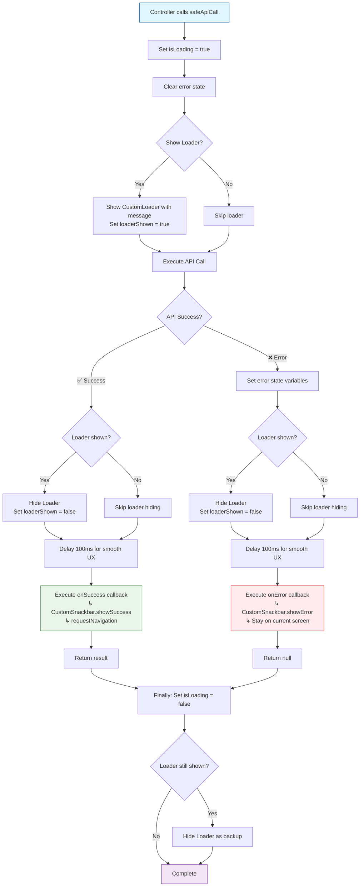
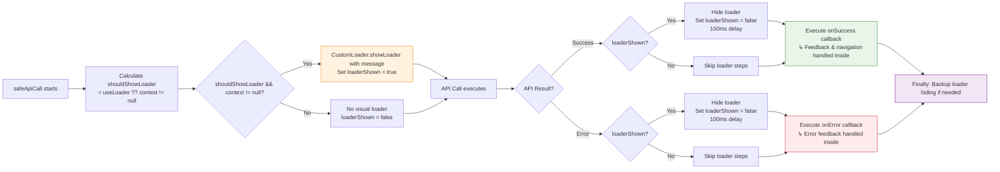
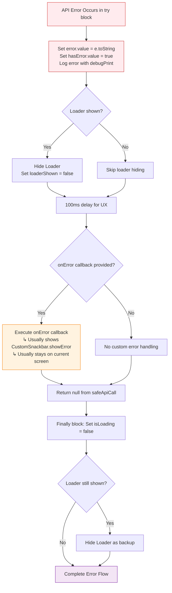

# API Call Guidance - KiokuNavi Flutter App

## Overview

This document provides comprehensive guidance for making API calls in the KiokuNavi Flutter application using our enhanced `safeApiCall` system with integrated loading states, error handling, and custom snackbar notifications.

## Table of Contents

1. [Architecture Overview](#architecture-overview)
2. [BaseController safeApiCall Method](#basecontroller-safeapicall-method)
3. [Flow Diagrams](#flow-diagrams)
4. [Usage Examples](#usage-examples)
5. [Best Practices](#best-practices)
6. [Error Handling Patterns](#error-handling-patterns)
7. [Custom Snackbar Integration](#custom-snackbar-integration)

## Architecture Overview

Our API calling system consists of several main components:

- **BaseController**: Provides `safeApiCall` method with loading states and error handling
- **CustomLoader**: Visual loading indicator management
- **CustomSnackbar**: User feedback for success/error states
- **TokenManager**: Handles authentication token storage using GetStorage
- **AuthApiImpl**: Automatically saves user data (name, email, is_student) on login
- **RouteHelper**: Determines initial routes based on authentication and user type

```
┌─────────────────┐    ┌──────────────────┐    ┌─────────────────┐
│   Controller    │───▶│  BaseController  │───▶│   API Service   │
│                 │    │   safeApiCall    │    │                 │
└─────────────────┘    └──────────────────┘    └─────────────────┘
         │                       │                       │
         ▼                       ▼                       ▼
┌─────────────────┐    ┌──────────────────┐    ┌─────────────────┐
│  Custom Loader  │    │ Custom Snackbar  │    │   Navigation    │
│                 │    │                  │    │                 │
└─────────────────┘    └──────────────────┘    └─────────────────┘
```

## BaseController safeApiCall Method

### Method Signature

```dart
Future<T?> safeApiCall<T>(
  Future<T> Function() apiCall, {
  BuildContext? context,
  String? loaderMessage,
  bool? useLoader,
  VoidCallback? onSuccess,
  Function(dynamic error)? onError,
})
```

### Parameters

| Parameter | Type | Required | Description |
|-----------|------|----------|-------------|
| `apiCall` | `Future<T> Function()` | ✅ Yes | The API function to execute |
| `context` | `BuildContext?` | ❌ No | BuildContext for showing loader |
| `loaderMessage` | `String?` | ❌ No | Message to display in loader |
| `useLoader` | `bool?` | ❌ No | Whether to show visual loader (default: true if context provided) |
| `onSuccess` | `VoidCallback?` | ❌ No | Callback executed after successful API call |
| `onError` | `Function(dynamic error)?` | ❌ No | Callback executed when API call fails |

### Return Value

- Returns `T?` - The result of the API call on success, `null` on error
- Sets `isLoading.value` reactive state
- Sets `error.value` and `hasError.value` reactive states

## Flow Diagrams

### Complete API Call Flow



### Loader Management Flow



### Error Handling Flow



## Usage Examples

### 1. Basic API Call with Loading

```dart
// Simple API call with automatic loading state
Future<void> fetchUserData() async {
  final result = await safeApiCall(
    () => _userApi.getCurrentUser(),
    context: context,
    loaderMessage: 'Loading user data...',
  );
  
  if (result != null) {
    // Handle success
    userData.value = result;
  }
}
```

### 2. Authentication Flow with Success/Error Handling

```dart
// Student Login with automatic token and user data storage
Future<void> loginStudent(BuildContext context) async {
  await safeApiCall(
    () async {
      if (!studentLoginFormKey.currentState!.validate()) {
        throw 'Please fill in all required fields correctly';
      }
      
      // API automatically saves token and user data (name, email, is_student)
      return await _authApi.loginStudent(email.text, password.text);
    },
    context: context,
    loaderMessage: 'Logging in...',
    onSuccess: () {
      CustomSnackbar.showSuccess(
        title: 'Welcome!',
        message: 'Login successful',
      );
      // RouteHelper will automatically determine correct route based on user type
      requestNavigation(Routes.CHILD_HOME);
    },
    onError: (error) {
      CustomSnackbar.showError(
        title: 'Login Failed',
        message: 'Please check your credentials and try again',
      );
    },
  );
}

// Parent Login with automatic token and user data storage
Future<void> loginParent(BuildContext context) async {
  await safeApiCall(
    () async {
      if (!parentLoginFormKey.currentState!.validate()) {
        throw 'Please fill in all required fields correctly';
      }
      
      // API automatically saves token and user data (name, email, is_student)
      return await _authApi.loginParent(email.text, password.text);
    },
    context: context,
    loaderMessage: 'Logging in...',
    onSuccess: () {
      CustomSnackbar.showSuccess(
        title: 'Welcome!',
        message: 'Login successful',
      );
      // RouteHelper will automatically determine correct route based on user type
      requestNavigation(Routes.HOME);
    },
    onError: (error) {
      CustomSnackbar.showError(
        title: 'Login Failed',
        message: 'Please check your credentials and try again',
      );
    },
  );
}
```

### 3. Data Fetching without Navigation

```dart
// Fetch data with error handling but no navigation
Future<List<Course>?> loadCourses() async {
  return await safeApiCall(
    () => _courseApi.getAllCourses(),
    context: context,
    loaderMessage: 'Loading courses...',
    onError: (error) {
      CustomSnackbar.showError(
        title: 'Load Failed',
        message: 'Unable to load courses. Please try again',
      );
    },
    // No onSuccess needed for data fetching
  );
}
```

### 4. Silent API Call (No UI Feedback)

```dart
// Background API call without loader or snackbars
Future<void> syncUserPreferences() async {
  await safeApiCall(
    () => _preferencesApi.sync(userPreferences),
    useLoader: false, // Explicitly disable loader
    // No onSuccess or onError - silent operation
  );
}
```

### 5. Custom Error Handling

```dart
// API call with custom error logic
Future<void> uploadFile(File file) async {
  await safeApiCall(
    () => _fileApi.upload(file),
    context: context,
    loaderMessage: 'Uploading file...',
    onSuccess: () {
      CustomSnackbar.showSuccess(
        title: 'Upload Complete',
        message: 'File uploaded successfully',
      );
      refreshFileList();
    },
    onError: (error) {
      // Custom error handling based on error type
      if (error.toString().contains('network')) {
        CustomSnackbar.showError(
          title: 'Network Error',
          message: 'Check your internet connection',
        );
      } else if (error.toString().contains('size')) {
        CustomSnackbar.showError(
          title: 'File Too Large',
          message: 'Please select a smaller file',
        );
      } else {
        CustomSnackbar.showError(
          title: 'Upload Failed',
          message: 'Unable to upload file. Please try again',
        );
      }
    },
  );
}
```

## Best Practices

### 1. Always Provide Context for User-Facing Operations

```dart
// ✅ Good - User sees loading feedback
await safeApiCall(
  () => _api.login(email, password),
  context: context,
  loaderMessage: 'Logging in...',
);

// ❌ Avoid - No user feedback
await safeApiCall(() => _api.login(email, password));
```

### 2. Use Appropriate Snackbar Types

```dart
// ✅ Success operations
CustomSnackbar.showSuccess(title: 'Done!', message: 'Operation completed');

// ✅ Informational messages
CustomSnackbar.showInfo(title: 'Note', message: 'Settings saved locally');

// ✅ Error conditions
CustomSnackbar.showError(title: 'Failed', message: 'Please try again');
```

### 3. Validate Forms Before API Calls

```dart
await safeApiCall(
  () async {
    // Always validate first
    if (!formKey.currentState!.validate()) {
      throw 'Please fill in all required fields correctly';
    }
    
    return await _api.submitForm(formData);
  },
  // ... rest of parameters
);
```

### 4. Handle Navigation in onSuccess Only

```dart
await safeApiCall(
  () => _api.deleteItem(itemId),
  onSuccess: () {
    CustomSnackbar.showSuccess(title: 'Deleted', message: 'Item removed');
    requestNavigation(Routes.BACK); // Navigate only on success
  },
  onError: (error) {
    CustomSnackbar.showError(title: 'Failed', message: 'Unable to delete');
    // Stay on current screen for retry
  },
);
```

### 5. Use Descriptive Loader Messages

```dart
// ✅ Specific and helpful
loaderMessage: 'Creating your account...'
loaderMessage: 'Uploading image...'
loaderMessage: 'Saving changes...'

// ❌ Generic and unhelpful
loaderMessage: 'Loading...'
loaderMessage: 'Please wait...'
```

## Error Handling Patterns

### 1. Network Errors

```dart
onError: (error) {
  if (error.toString().contains('SocketException') || 
      error.toString().contains('network')) {
    CustomSnackbar.showError(
      title: 'Connection Error',
      message: 'Please check your internet connection',
    );
  } else {
    CustomSnackbar.showError(
      title: 'Error',
      message: 'Something went wrong. Please try again',
    );
  }
}
```

### 2. Validation Errors

```dart
onError: (error) {
  if (error.toString().contains('validation')) {
    CustomSnackbar.showError(
      title: 'Invalid Input',
      message: 'Please check your information and try again',
    );
  } else {
    // Handle other errors
  }
}
```

### 3. Authentication Errors

```dart
onError: (error) {
  if (error.toString().contains('401') || 
      error.toString().contains('unauthorized')) {
    CustomSnackbar.showError(
      title: 'Session Expired',
      message: 'Please log in again',
    );
    requestNavigation(Routes.LOGIN);
  } else {
    // Handle other errors
  }
}
```

## Custom Snackbar Integration

### Available Methods

```dart
// Success notifications (Green with check icon)
CustomSnackbar.showSuccess(
  title: 'Success!',
  message: 'Operation completed successfully',
);

// Error notifications (Red with error icon)
CustomSnackbar.showError(
  title: 'Error!',
  message: 'Something went wrong',
);

// Info notifications (Blue with info icon)
CustomSnackbar.showInfo(
  title: 'Information',
  message: 'Here is some important info',
);

// Generic method with status parameter
CustomSnackbar.show(
  title: 'Title',
  message: 'Message',
  status: Status.SUCCESS, // or Status.ERROR, Status.INFO
);
```

### Snackbar Features

- **Auto-dismissal**: 1 second duration
- **Swipe to dismiss**: Horizontal swipe gesture
- **Custom styling**: Shadows, borders, responsive text
- **Icons**: Contextual icons for each status type
- **Positioning**: Bottom of screen with margins

## Migration from Old System

### Before (Old System)

```dart
// Old way - manual loading and error handling
isLoading.value = true;
try {
  final result = await _api.getData();
  isLoading.value = false;
  Get.snackbar('Success', 'Data loaded');
  Get.toNamed(Routes.NEXT);
} catch (e) {
  isLoading.value = false;
  Get.snackbar('Error', e.toString());
}
```

### After (New System)

```dart
// New way - automatic handling with safeApiCall
await safeApiCall(
  () => _api.getData(),
  context: context,
  loaderMessage: 'Loading data...',
  onSuccess: () {
    CustomSnackbar.showSuccess(title: 'Success', message: 'Data loaded');
    requestNavigation(Routes.NEXT);
  },
  onError: (error) {
    CustomSnackbar.showError(title: 'Error', message: 'Failed to load data');
  },
);
```

## Authentication and User Data Storage

### Automatic Token and User Data Management

The authentication system automatically handles token and user data storage:

```dart
// Login response structure from Laravel Sanctum backend
{
  "data": {
    "user": {
      "id": 4,
      "name": "Test User",
      "email": "test@test.com",
      "created_at": "2025-07-10T12:35:19.000000Z"
    },
    "token": "eyJ0eXAiOiJKV1QiLCJhbGciOiJIUzI1NiJ9...",
    "token_type": "bearer",
    "is_student": true
  }
}
```

### Storage Keys Used

The system automatically stores the following data in GetStorage:

| Key | Type | Description |
|-----|------|-------------|
| `token` | String | JWT authentication token |
| `user_name` | String | User's full name |
| `user_email` | String | User's email address |
| `is_student` | Boolean | Whether user is a student (true) or parent (false) |

### Route Helper Integration

The `RouteHelper.getInitialRoute()` method automatically determines the correct initial route:

```dart
// Route determination logic
String getInitialRoute() {
  try {
    final tokenManager = Get.find<TokenManager>();
    final isAuthenticated = tokenManager.isAuthenticatedSync();
    
    if (!isAuthenticated) {
      return Routes.ROOT_SCREEN; // Login/Register screen
    }

    // Get user type from storage
    final storage = Get.find<GetStorage>();
    final isStudent = storage.read(kIsStudent) ?? false;

    // Route based on user type
    return isStudent ? Routes.CHILD_HOME : Routes.HOME;
  } catch (e) {
    return Routes.ROOT_SCREEN;
  }
}
```

### Logout Cleanup

The logout process automatically clears all stored data:

```dart
Future<void> logout() async {
  await safeApiCall(
    () async {
      await _authApi.logout(); // Clears token AND user data
    },
    context: context,
    loaderMessage: 'Logging out...',
    onSuccess: () {
      CustomSnackbar.showInfo(
        title: 'Goodbye!',
        message: 'You have been logged out successfully',
      );
      requestNavigation(Routes.ROOT_SCREEN);
    },
  );
}
```

## Conclusion

The enhanced `safeApiCall` system provides:

- **Consistent UX**: Standardized loading and feedback patterns
- **Error Resilience**: Automatic error handling with user feedback
- **Code Simplification**: Reduces boilerplate for common API patterns
- **Maintainability**: Centralized loading and error logic
- **Accessibility**: Clear feedback for all user actions
- **Automatic Data Management**: Seamless token and user data storage
- **Smart Routing**: User-type based route determination

By following these guidelines, you ensure a consistent, user-friendly experience across the entire KiokuNavi application. 